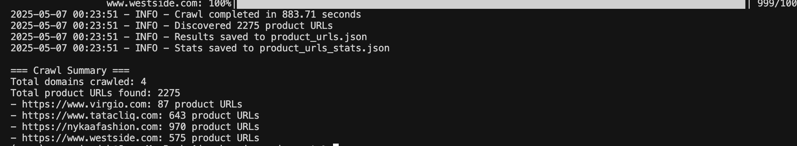

# E-commerce Product URL Crawler [Flow Diagram](https://www.mermaidchart.com/raw/46ed5f04-fa3c-41e0-82f9-eb4aaeca408f?theme=light&version=v0.1&format=svg)

A Python-based web crawler designed to discover product URLs on e-commerce websites. The crawler implements a breadth-first search approach and uses asynchronous requests to efficiently explore websites, identify product pages, and compile a list of product URLs.

## Features

- **Intelligent URL Discovery**: Automatically identifies product pages using URL patterns and content analysis
- **Adaptive Pattern Learning**: Learns new product URL patterns specific to each domain during crawling
- **Scalable Architecture**: Handles multiple domains concurrently with asynchronous processing
- **Rate Limiting**: Respects website resources with configurable request delays
- **Progress Tracking**: Real-time progress indicators for each domain being crawled
- **Comprehensive Output**: Provides detailed results with statistics

## Approach to Finding Product URLs

The crawler employs multiple strategies to identify product URLs:

### 1. URL Pattern Recognition

The crawler looks for common e-commerce product URL patterns such as:

**Standard product paths:**
- `/product/`, `/products/`
- `/item/`, `/items/`
- `/p/`, `/pd/`
- `/buy/`
- `/shop/`, `/shopping/`
- `/goods/`
- `/detail/`, `/productdetail/`
- `/prod/`

**E-commerce specific paths:**
- `/catalog/`
- `/collection/`, `/collections/`
- `/category/`, `/categories/`
- `/dp/` (common on Amazon-style sites)
- `/sku/`
- `/merchandise/`, `/merch/`
- `/article/`
- `/view/`, `/productview/`

**India-specific e-commerce paths:**
- `/fashion/`
- `/clothing/`, `/apparel/`
- `/ethnic/`
- `/accessories/`, `/jewellery/`
- `/footwear/`
- `/beauty/`
- `/home/`, `/furniture/`

**Product identifier patterns:**
- IDs in URLs: `/id12345`
- HTML product pages: `/12345.html`
- Alphanumeric product codes
- Common product URL formats like `-p-12345.html`

### 2. Adaptive Pattern Learning

As the crawler explores each website, it analyzes page content for product indicators such as:

**Product ID attributes:**
- `data-product-id`, `product-id`, `productId`
- `data-pid`, `data-sku`, `sku-id`
- `item-id`, `variant-id`

**Shopping functionality:**
- "Add to cart" buttons and variations
- "Buy now" buttons
- "Add to wishlist" functionality
- Price elements and selectors

**Product detail elements:**
- Product description sections
- Product title elements
- Size and color selectors
- Customer review sections

**India-specific indicators:**
- MRP (Maximum Retail Price) elements
- Pincode check features (delivery availability)
- EMI options
- Delivery information

When it finds these indicators, it learns both the primary URL pattern (`/category/`) and more specific patterns (`/category/subcategory/`) of that page and adds them to its domain-specific pattern list, improving detection for subsequent pages.

### 3. Breadth-First Search with Enhanced Link Extraction

The crawler uses a breadth-first search approach to systematically explore the website structure:

1. Start at the homepage
2. Extract all links from the current page using multiple strategies:
   - Standard anchor tags
   - Product cards and grid items
   - Data attributes that may contain URLs
   - Onclick handlers with navigation
3. Process URL parameters intelligently:
   - Preserve query parameters for potential product URLs
   - Handle URL fragments appropriately
   - Normalize URLs to avoid duplicates
4. Queue new links for processing based on relevance
5. Identify product URLs using the multi-layered detection approach
6. Continue until reaching the maximum page limit or exhausting all pages

The enhanced link extraction process significantly improves the crawler's ability to discover product URLs in modern e-commerce sites that use JavaScript frameworks and dynamic content loading.

### 4. Parallel Processing

To handle large websites efficiently, the crawler:
- Processes multiple domains concurrently
- Makes multiple requests in parallel within each domain
- Implements rate limiting to respect web server resources

## Installation

```bash
# Clone the repository
git clone https://github.com/yourusername/ecommerce-product-crawler.git
cd ecommerce-product-crawler

# Create a virtual environment (optional but recommended)
python -m venv venv
source venv/bin/activate  # On Windows: venv\Scripts\activate

# Install dependencies
pip install -r requirements.txt
```

## Usage

### Basic Usage

```bash
python ecommerce_crawler.py --domains www.virgio.com www.tatacliq.com nykaafashion.com www.westside.com --output product_urls.json
```

### Advanced Options

```bash
python ecommerce_crawler.py \
  --domains www.virgio.com www.tatacliq.com nykaafashion.com www.westside.com \
  --output product_urls.json \
  --max-pages 2000 \
  --concurrency 15 \
  --delay 0.3 \
  --timeout 20 \
  --debug
```

### Command Line Arguments

- `--domains`: List of domains to crawl (required)
- `--output`: Output file path (default: product_urls.json)
- `--max-pages`: Maximum pages to crawl per domain (default: 1000)
- `--concurrency`: Maximum concurrent requests (default: 10)
- `--delay`: Delay between requests to the same domain in seconds (default: 0.5)
- `--timeout`: Request timeout in seconds (default: 30)
- `--debug`: Enable debug logging

## Output Format

The crawler saves results in JSON format:

```json
{
  "https://www.example.com": [
    "https://www.example.com/product/12345",
    "https://www.example.com/product/67890",
    ...
  ],
  "https://www.another-site.com": [
    "https://www.another-site.com/item/abc123",
    "https://www.another-site.com/item/def456",
    ...
  ]
}
```

Additionally, it generates a statistics file with information about the crawl:

```json
{
  "domains": 4,
  "total_product_urls": 3627,
  "product_urls_per_domain": {
    "https://www.example.com": 1245,
    "https://www.another-site.com": 982,
    ...
  },
  "pages_crawled_per_domain": {
    "https://www.example.com": 1000,
    "https://www.another-site.com": 1000,
    ...
  }
}
```

Demo Output on command line for 1000 request per site with 10 max concurrent requests, 10sec timeout and 2sec request delay


## Performance Considerations

- **Memory Usage**: The crawler maintains sets of visited URLs and discovered product URLs in memory. For extremely large websites, this may require significant memory.
- **Rate Limiting**: The default delay between requests to the same domain is 0.5 seconds. Adjust this based on the website's terms of service and server capacity.
- **Timeout**: The default request timeout is 30 seconds. Lower this value for faster crawling but potentially more failed requests.
- **Maximum Pages**: The default maximum pages per domain is 1000. Increase this for more comprehensive crawling of large websites.

## Extending the Crawler

### Adding Custom Product Indicators

Edit the `PRODUCT_INDICATORS` list in the code to add custom product page indicators:

```python
PRODUCT_INDICATORS = [
    'data-product-id',
    'product-id',
    'productId',
    'data-pid',
    'add-to-cart',
    'data-sku',
    'add_to_cart',
    # Add your custom indicators here
    'your-custom-indicator',
]
```

### Adding Custom URL Patterns

Edit the `PRODUCT_URL_PATTERNS` list in the code to add custom product URL patterns:

```python
PRODUCT_URL_PATTERNS = [
    r'/product[s]?/',
    r'/item[s]?/',
    r'/p/',
    # Add your custom patterns here
    r'/your-custom-pattern/',
]
```

## License

MIT

## Author

Joy deb
